# 🗺️ Chronobi Website Sitemap

```mermaid
graph TD
    A[Chronobi AI Platform] --> B[Home Page /]
    A --> C[Dashboard /dashboard]
    A --> D[Market Screener /market-screener]
    A --> E[Signal Center /signal-center]
    A --> F[AI Insights /ai-insights]
    A --> G[Notifications /notifications]
    A --> H[My Filters & Watchlist /watchlist]
    A --> I[Login/Signup /login]
    A --> Z[404 Not Found /*]
    
    B --> B1[Hero Section]
    B --> B2[Market Ticker]
    B --> B3[Call-to-Action]
    
    B1 --> B1A[Brand Pitch]
    B1 --> B1B[Value Proposition]
    B1 --> B1C[Real-time Asset Signals]
    
    C --> C1[Personal Dashboard]
    C --> C2[Latest Alerts]
    C --> C3[Watchlist Overview]
    C --> C4[Asset Insights]
    
    D --> D1[Market Filters]
    D --> D2[Asset Categories]
    D --> D3[Custom Criteria]
    
    D1 --> D1A[Price Change %]
    D1 --> D1B[Volume Filters]
    D1 --> D1C[RSI Conditions]
    D1 --> D1D[Technical Indicators]
    
    D2 --> D2A[Crypto Markets]
    D2 --> D2B[Stock Markets]
    D2 --> D2C[Forex Markets]
    D2 --> D2D[Commodities]
    
    E --> E1[Recent Signals]
    E --> E2[Signal Analysis]
    E --> E3[AI Explanations]
    
    E1 --> E1A[Buy/Sell Signals]
    E1 --> E1B[Confidence Scores]
    E1 --> E1C[Time Stamps]
    E1 --> E1D[Strategy Types]
    
    E2 --> E2A[Signal Strength]
    E2 --> E2B[Market Context]
    E2 --> E2C[Risk Assessment]
    
    E3 --> E3A[GPT-4 Analysis]
    E3 --> E3B[Strategy Explanation]
    E3 --> E3C[Market Reasoning]
    
    F --> F1[AI Chat Interface]
    F --> F2[Market Insights]
    F --> F3[Strategy Library]
    
    F1 --> F1A[Ask Questions]
    F1 --> F1B[Asset Analysis]
    F1 --> F1C[Trend Explanations]
    
    F2 --> F2A[Market Outlook]
    F2 --> F2B[Sector Analysis]
    F2 --> F2C[Risk Alerts]
    
    F3 --> F3A[Momentum Trading]
    F3 --> F3B[Mean Reversion]
    F3 --> F3C[Breakout Strategies]
    F3 --> F3D[Technical Patterns]
    
    G --> G1[Notification Settings]
    G --> G2[Alert History]
    G --> G3[Delivery Methods]
    
    G1 --> G1A[Alert Types]
    G1 --> G1B[Frequency Control]
    G1 --> G1C[Priority Levels]
    
    G2 --> G2A[Recent Alerts]
    G2 --> G2B[Delivery Status]
    G2 --> G2C[Alert Performance]
    
    G3 --> G3A[Telegram Integration]
    G3 --> G3B[Email Notifications]
    G3 --> G3C[SMS Alerts]
    
    H --> H1[Personal Watchlist]
    H --> H2[Custom Filters]
    H --> H3[Asset Tracking]
    
    H1 --> H1A[Favorite Assets]
    H1 --> H1B[Price Monitoring]
    H1 --> H1C[Performance Tracking]
    
    H2 --> H2A[Saved Criteria]
    H2 --> H2B[Filter Management]
    H2 --> H2C[Auto-Running Filters]
    
    I --> I1[Sign In Form]
    I --> I2[Sign Up Form]
    I --> I3[Social Login]
    
    I1 --> I1A[Email/Password]
    I1 --> I1B[Remember Me]
    I1 --> I1C[Forgot Password]
    
    I2 --> I2A[User Registration]
    I2 --> I2B[Email Verification]
    I2 --> I2C[Terms Agreement]
    
    I3 --> I3A[Google OAuth]
    I3 --> I3B[GitHub OAuth]
    
    Z --> Z1[Error Message]
    Z --> Z2[Return Navigation]
    
    classDef mainPage fill:#1e40af,stroke:#3b82f6,stroke-width:3px,color:#fff
    classDef section fill:#059669,stroke:#10b981,stroke-width:2px,color:#fff
    classDef feature fill:#7c3aed,stroke:#a855f7,stroke-width:2px,color:#fff
    classDef detail fill:#dc2626,stroke:#ef4444,stroke-width:1px,color:#fff
    
    class A mainPage
    class B,C,D,E,F,G,H,I,Z section
    class B1,B2,B3,C1,C2,C3,C4,D1,D2,D3,E1,E2,E3,F1,F2,F3,G1,G2,G3,H1,H2,H3,I1,I2,I3,Z1,Z2 feature
    class B1A,B1B,B1C,D1A,D1B,D1C,D1D,D2A,D2B,D2C,D2D,E1A,E1B,E1C,E1D,E2A,E2B,E2C,E3A,E3B,E3C,F1A,F1B,F1C,F2A,F2B,F2C,F3A,F3B,F3C,F3D,G1A,G1B,G1C,G2A,G2B,G2C,G3A,G3B,G3C,H1A,H1B,H1C,H2A,H2B,H2C,I1A,I1B,I1C,I2A,I2B,I2C,I3A,I3B detail
```

## Key Features Implemented:

### 🏠 **Home Page**
- Hero section with Chronobi branding
- Value proposition: "Real-time asset signals and AI trading insights"
- Market ticker with live data
- Call-to-action for user engagement

### 📊 **Dashboard** (Login Required)
- Personalized trading dashboard
- Recent signals and alerts
- Portfolio overview and insights
- Asset tracking and performance

### 🔍 **Market Screener**
- Multi-asset filtering (Crypto, Stocks, Forex, Commodities)
- Custom criteria setup (RSI, Volume, Price Change, etc.)
- Real-time market data
- Advanced filtering options

### 🎯 **Signal Center**
- Table of recent buy/sell signals
- Signal confidence scores and timestamps
- Strategy type identification
- AI-powered signal explanations
- One-click GPT analysis

### 🤖 **AI Insights**
- Interactive AI chat interface
- Market trend analysis
- Trading strategy library
- Personalized recommendations
- Educational content integration

### 🔔 **Notifications**
- Multi-channel alert delivery (Telegram, Email, SMS)
- Notification preferences management
- Alert history and performance tracking
- Custom notification rules

### ⭐ **My Filters & Watchlist**
- Personal asset watchlist
- Custom filter creation and management
- Saved search criteria
- Asset performance tracking

### 🔐 **Authentication**
- Sign in/Sign up forms
- Social login integration (Google, GitHub)
- Password recovery
- User account management

## Technical Implementation:
- **React Router** for navigation
- **Responsive design** for mobile/desktop
- **Modern UI components** with Tailwind CSS
- **Real-time data integration** ready
- **AI-powered features** architecture
- **Multi-asset support** structure
- **Notification system** framework

The site now fully reflects the Chronobi brand with the integrated logo and follows the detailed sitemap structure you provided!
