# Chronobi AI Trading Platform - Sitemap & Features Documentation

## 🗺️ Platform Sitemap

```mermaid
graph TB
    A[🏠 Home Page] --> B[📊 Dashboard]
    A --> C[🔍 Market Screener]
    A --> D[📡 Signal Center]
    A --> E[🤖 AI Insights]
    A --> F[👁️ My Filters & Watchlist]
    A --> G[🔔 Notifications]
    A --> H[🔐 Login/Signup]
    
    B --> B1[📈 Portfolio Overview]
    B --> B2[📊 Market Analysis]
    B --> B3[⚡ Live Trading Dashboard]
    B --> B4[📉 Advanced Charts]
    
    C --> C1[🔍 Stock Screener]
    C --> C2[💰 Crypto Screener]
    C --> C3[💱 Forex Screener]
    C --> C4[🏭 Commodity Screener]
    C --> C5[⚙️ Custom Filters]
    
    D --> D1[📡 Live Signals]
    D --> D2[📊 Signal Analytics]
    D --> D3[🎯 Strategy Center]
    D --> D4[📈 Performance Tracking]
    
    E --> E1[🤖 AI Chat Assistant]
    E --> E2[📚 Strategy Library]
    E --> E3[💡 Market Insights]
    E --> E4[🎓 Learning Center]
    
    F --> F1[⭐ Watchlists]
    F --> F2[🔍 Saved Filters]
    F --> F3[📊 Portfolio Tracking]
    F --> F4[🎯 Price Alerts]
    
    G --> G1[⚙️ Notification Settings]
    G --> G2[📱 Alert Preferences]
    G --> G3[📧 Email Notifications]
    G --> G4[📱 SMS/Telegram Alerts]
    G --> G5[📜 Notification History]
    
    H --> H1[🔑 User Authentication]
    H --> H2[👤 Profile Management]
    H --> H3[🔒 Security Settings]
    H --> H4[💳 Subscription Management]
    
    style A fill:#4f46e5,stroke:#333,stroke-width:3px,color:#fff
    style B fill:#059669,stroke:#333,stroke-width:2px,color:#fff
    style C fill:#0891b2,stroke:#333,stroke-width:2px,color:#fff
    style D fill:#dc2626,stroke:#333,stroke-width:2px,color:#fff
    style E fill:#7c3aed,stroke:#333,stroke-width:2px,color:#fff
    style F fill:#ea580c,stroke:#333,stroke-width:2px,color:#fff
    style G fill:#0d9488,stroke:#333,stroke-width:2px,color:#fff
    style H fill:#be123c,stroke:#333,stroke-width:2px,color:#fff
```

## 🚀 Platform Features & Capabilities

### 🏠 **Home Page**
- **Hero Section**: Welcome interface with call-to-action
- **Live Market Ticker**: Real-time price updates for major assets
- **Demo Mode**: Interactive demonstration of platform capabilities
- **Feature Highlights**: Overview of key platform benefits
- **Quick Navigation**: Easy access to main platform sections

### 📊 **Dashboard - Trading Command Center**
- **Multi-Asset Portfolio Overview**
  - Real-time P&L tracking
  - Asset allocation visualization
  - Performance metrics and analytics
  - Risk assessment indicators
  
- **Advanced Charting System**
  - TradingView-style interactive charts
  - 20+ technical indicators
  - Multiple timeframes (1m to 1W)
  - Drawing tools and pattern recognition
  
- **Market Intelligence Hub**
  - Sentiment analysis
  - News integration
  - Market volatility indicators
  - Economic calendar events
  
- **Live Trading Interface**
  - One-click trading execution
  - Position management
  - Order book visualization
  - Trade history tracking

### 🔍 **Market Screener - Advanced Filtering**
- **Multi-Market Support**
  - Stocks (NYSE, NASDAQ, LSE, etc.)
  - Cryptocurrencies (500+ coins)
  - Forex pairs (Major, Minor, Exotic)
  - Commodities (Gold, Oil, Agricultural)
  
- **Powerful Filtering Engine**
  - 50+ technical indicators
  - Fundamental analysis metrics
  - Price action patterns
  - Volume and liquidity filters
  
- **Smart Screening Features**
  - Pre-built screening strategies
  - Custom filter creation
  - Real-time results
  - Export capabilities
  
- **Performance Analytics**
  - Historical backtesting
  - Success rate tracking
  - Risk-adjusted returns
  - Comparative analysis

### 📡 **Signal Center - AI-Powered Trading Signals**
- **Real-Time Signal Generation**
  - Machine learning algorithms
  - 80%+ accuracy rate
  - Multi-timeframe analysis
  - Risk-reward optimization
  
- **Signal Types**
  - Entry/Exit signals
  - Trend reversal alerts
  - Momentum breakouts
  - Support/resistance levels
  
- **Strategy Center**
  - 15+ pre-built strategies
  - Momentum trading
  - Mean reversion
  - Breakout trading
  - RSI divergence patterns
  
- **Performance Tracking**
  - Win/loss ratios
  - Average returns
  - Drawdown analysis
  - Risk metrics

### 🤖 **AI Insights - Intelligent Trading Assistant**
- **AI Chat Assistant**
  - Natural language processing
  - Market analysis questions
  - Strategy explanations
  - Portfolio optimization advice
  
- **Strategy Library**
  - Detailed strategy guides
  - Risk management techniques
  - Market psychology insights
  - Educational content
  
- **Market Intelligence**
  - AI-generated market outlook
  - Trend predictions
  - Sentiment analysis
  - News impact assessment
  
- **Learning Center**
  - Interactive tutorials
  - Trading fundamentals
  - Technical analysis education
  - Risk management principles

### 👁️ **My Filters & Watchlist**
- **Personal Watchlists**
  - Custom asset groups
  - Real-time price monitoring
  - Alert integration
  - Performance tracking
  
- **Saved Filters**
  - Reusable screening criteria
  - Automated updates
  - Shareable configurations
  - Historical performance
  
- **Portfolio Management**
  - Asset allocation tracking
  - Rebalancing suggestions
  - Risk exposure analysis
  - Performance attribution
  
- **Price Alerts**
  - Threshold-based alerts
  - Technical indicator triggers
  - News-based notifications
  - Multi-channel delivery

### 🔔 **Notifications - Smart Alert System**
- **Multi-Channel Delivery**
  - Email notifications
  - SMS alerts
  - Telegram integration
  - In-app notifications
  
- **Alert Types**
  - Price alerts
  - Signal notifications
  - Market news updates
  - Portfolio changes
  
- **Customization Options**
  - Alert frequency settings
  - Priority levels
  - Time-based scheduling
  - Asset-specific preferences
  
- **History & Analytics**
  - Notification tracking
  - Delivery confirmations
  - Performance metrics
  - Alert effectiveness

### 🔐 **Authentication & Security**
- **User Authentication**
  - Secure login/signup
  - Password encryption
  - Session management
  - Multi-factor authentication
  
- **Profile Management**
  - Personal information
  - Trading preferences
  - Risk tolerance settings
  - Notification preferences
  
- **Security Features**
  - Data encryption
  - Secure API connections
  - Privacy protection
  - Audit logging

## 🛠️ **Technical Architecture**

### **Frontend Technologies**
- **React 18**: Modern component-based architecture
- **TypeScript**: Type-safe development
- **Tailwind CSS**: Utility-first styling
- **shadcn/ui**: Premium UI components
- **Vite**: Fast build tool and dev server

### **Key Components**
- **VortexBackground**: Animated SVG background system
- **Advanced Charts**: Interactive trading charts
- **AI Chat**: Natural language processing interface
- **Market Screener**: Real-time filtering engine
- **Signal Generator**: Machine learning algorithms

### **Features Integration**
- **Real-time Data**: WebSocket connections
- **State Management**: React hooks and context
- **Responsive Design**: Mobile-first approach
- **Performance Optimization**: Lazy loading and code splitting
- **Accessibility**: WCAG compliance

## 📱 **Cross-Platform Compatibility**
- **Web Application**: Desktop and mobile browsers
- **Responsive Design**: Optimized for all screen sizes
- **Progressive Web App**: Offline capabilities
- **API Integration**: RESTful services
- **Real-time Updates**: WebSocket connections

## 🎯 **Target Users**
- **Beginner Traders**: Educational resources and guided trading
- **Intermediate Traders**: Advanced tools and analytics
- **Professional Traders**: Institutional-grade features
- **Portfolio Managers**: Multi-asset management tools
- **Financial Advisors**: Client portfolio oversight

## 🚀 **Future Enhancements**
- **Mobile App**: Native iOS and Android applications
- **Advanced AI**: GPT-4 integration for enhanced insights
- **Social Trading**: Copy trading and social features
- **Backtesting Engine**: Historical strategy testing
- **API Access**: Developer-friendly trading APIs

---

*Chronobi AI Trading Platform - Empowering traders with artificial intelligence and advanced analytics.*
